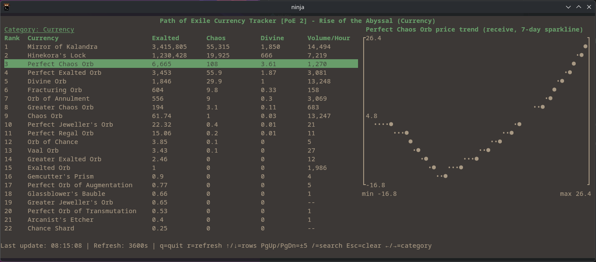
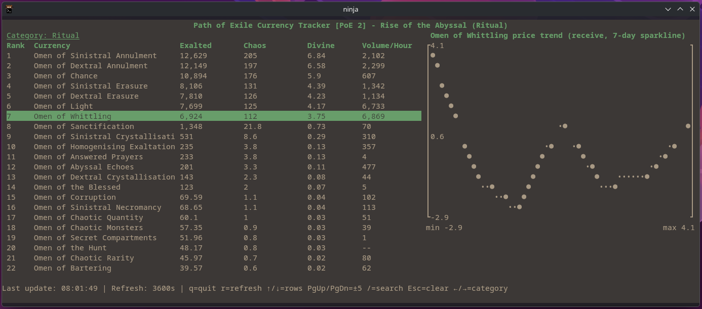

# PoE Currency Tracker

Lightweight curses terminal UI for visualising Path of Exile currency prices via the PoE Ninja API.

## Features

- Live currency overview for any league and category supported by PoE Ninja
- Refresh interval control to remain polite to the public API
- Keyboard navigation with highlighted selection
- Inline ASCII sparkline showing recent trend for the selected currency
- Minimal dependencies: relies solely on the Python standard library



## Requirements

- Python 3.10 or later
- Unix-like terminal with basic colour support (tested on Arch Linux)
- Network access to `https://poe.ninja`

## Usage

```bash
python -m poe_tracker --league "Rise of the Abyssal" --category Currency --limit 35 --interval 120
```

Arguments:

- `--league`: target Path of Exile league (default `Rise of the Abyssal`)
- `--category`: PoE Ninja overview category (`Currency`, `Fragment`, …)
- `--game`: set `poe2` (default) or `poe` for the original client
- `--ninja-cookie`: optional PoE.Ninja session cookie (or set `POE_NINJA_COOKIE`) for authenticated endpoints
- `--limit`: number of currencies to list
- `--interval`: refresh cadence in seconds (minimum 10s)

## Key Bindings

- `↑` / `j`: move selection up
- `↓` / `k`: move selection down
- `PgUp` / `PgDn`: jump several rows
- `r`: force refresh
- `q`: quit
- `/`: fuzzy search
- `Esc`: clear search
## Notes

- The PoE Ninja API enforces rate limits; the tool defaults to a 120 second refresh to stay within limits.
- When the API is unreachable, the status bar reports the failure and the UI continues to retry on the configured cadence.
